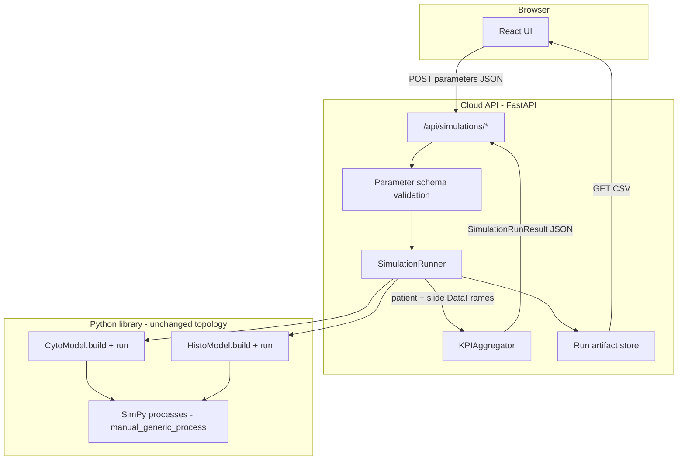
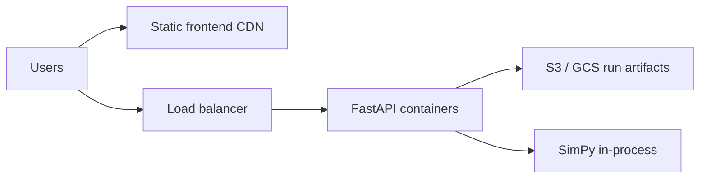

# DES Simulation App — Architecture & UX Plan

## What you already have (strong foundation)

Your repo already implements the right **separation of concerns** in spirit:

| Layer                   | Status            | Key files                                                                                                                                                                                      |
| ----------------------- | ----------------- | ---------------------------------------------------------------------------------------------------------------------------------------------------------------------------------------------- |
| **Fixed topology**      | Implemented       | [`backend/utils/manual_generic_process.py`](backend/utils/manual_generic_process.py), [`backend/v3.0_cytosim.py`](backend/v3.0_cytosim.py), [`backend/v1_histosim.py`](backend/v1_histosim.py) |
| **Tunable parameters**  | YAML + partial UI | [`backend/parameters/cyto_parameters.yaml`](backend/parameters/cyto_parameters.yaml), [`frontend/src/data/defaultParameters.ts`](frontend/src/data/defaultParameters.ts)                       |
| **Raw run trace (CSV)** | Implemented       | [`backend/sim_results/`](backend/sim_results/)                                                                                                                                                 |
| **KPI analysis**        | Notebook-only     | [`backend/notebooks/indicators.ipynb`](backend/notebooks/indicators.ipynb)                                                                                                                     |
| **User shell**          | React, mock API   | [`frontend/`](frontend/), [`frontend/src/api/simulationApi.ts`](frontend/src/api/simulationApi.ts)                                                                                             |

The main gap is not the DES model — it is the **orchestration layer** (callable simulator + KPI aggregation + HTTP API) between your scripts and the UI.

---

## Recommended architecture



### Design principles

1. **Architecture is code, parameters are data**  
   Users never edit process graphs. The pipeline (accessioning → fixation → staining → reporting, etc.) stays in Python. Only values in a versioned **parameter schema** change.

2. **Single source of truth for parameters**  
   Define a JSON Schema (or Pydantic models) generated from / aligned with [`cyto_parameters.yaml`](backend/parameters/cyto_parameters.yaml). The React [`CytoParameters`](frontend/src/types/simulation.ts) type should match this schema exactly. UI fields are generated or validated against it — not hand-maintained forever.

3. **Simulation returns two artifacts per run**
   - **Trace CSVs** (sanity / audit): patient + slide timestamp tables (you already export these).
   - **Summary JSON** (dashboard): KPIs + histograms + per-process stats (move logic out of notebooks into `KPIAggregator`).

4. **Sync API is fine for your workload**  
   With cloud deployment but &lt;30s runs, `POST /api/simulations/run` can block and return JSON + download links. Add async jobs later only if you enable 20–50 replications or longer horizons.

5. **Cloud-ready from day one**
   - Stateless API containers (Docker).
   - Per-run artifacts in object storage (S3/GCS) or ephemeral volume with TTL.
   - `runId` in every response; CSVs at `GET /api/simulations/{runId}/artifacts/{name}`.
   - CORS + `VITE_API_BASE` (already in [`.env.example`](frontend/.env.example)).

---

## Backend structure (proposed)

Refactor scripts into a small Python package under `backend/`:

```
backend/
  app/
    main.py              # FastAPI app, CORS, health
    routes/simulations.py
    schemas/parameters.py   # Pydantic CytoParameters, HistoParameters
    schemas/results.py      # extends SimulationRunResult
    services/runner.py      # build env, run once, return DataFrames + paths
    services/kpi.py         # TAT, utilization, waiting, queue stats
    storage/artifacts.py    # write CSVs, signed URLs or file paths
  models/
    cyto.py              # extracted from v3.0_cytosim.py
    histo.py             # extracted from v1_histosim.py
  utils/                 # keep existing DES primitives
  parameters/            # default YAML presets
```

**`SimulationRunner.run(kind, parameters, seed?)`** should:

1. Accept JSON parameters (not only file path).
2. Wire `simulation.run_time` from UI instead of hard-coded 12 months (or expose months as a capped field).
3. Apply warm-up exclusion (already documented in UI mock notes).
4. Write CSVs to `{runId}/patient_timestamps.csv` and `{runId}/slide_timestamps.csv`.
5. Return structured KPI dict matching the frontend contract.

**Do not duplicate** `utils/` at repo root — consolidate on [`backend/utils/`](backend/utils/) to avoid drift.

---

## KPIs and queue metrics (how to implement)

### A) Per-run CSV (sanity check) — already 80% done

Your cyto exports already capture per-entity timestamps via `queue_entry_time`, `process_start_time`, `process_end_time` on entities ([`manual_generic_process.py`](backend/utils/manual_generic_process.py) lines 143–184).

**API behaviour:** after run, expose:

- `GET /api/simulations/{runId}/artifacts/patient_timestamps.csv`
- `GET /api/simulations/{runId}/artifacts/slide_timestamps.csv`

Frontend: **Download raw trace** button in [`ResultsPanel.tsx`](frontend/src/components/results/ResultsPanel.tsx).

### B) Predefined KPIs — port notebook logic to `services/kpi.py`

| KPI                           | Source (today)                       | Computation                                                                      |
| ----------------------------- | ------------------------------------ | -------------------------------------------------------------------------------- |
| Turnaround time (median, p90) | `indicators.ipynb`                   | `Reporting End − Arrival` on patient CSV                                         |
| TAT histogram                 | mock in UI                           | Bucket patient TAT days                                                          |
| Patient breakdown             | mock in UI                           | Group by Pap / Non-Pap                                                           |
| Resource utilisation %        | planned in `v1_histosim.py` comments | Integrate busy time per `ScheduledResource` / `Resource` over simulation horizon |
| Throughput                    | derived                              | Completed patients / run days                                                    |

**Utilisation approach (recommended):** add lightweight monitors in `manual_generic_process` or a wrapper resource that increments `busy_minutes` when a request is granted and releases. Aggregate at end of run:

`utilisation_pct = busy_minutes / (capacity × available_minutes)` per resource type (cytotech, pathologist, staining station).

### C) Waiting times and queue lengths — two levels

**Level 1 — Post-hoc from trace (implement first, no DES changes):**

For each process `P` and each entity:

- `wait_P = process_start_time[P] − queue_entry_time[P]`
- Report median / p90 by process name in JSON: `processMetrics: [{ process, medianWaitMin, p90WaitMin, n }]`

This matches what older [`cyto_sim.py`](backend/older_sims/cyto_sim.py) did for inter-stage waiting and what [`generic_entity.get_waiting_time`](backend/utils/generic_entity.py) supports.

**Level 2 — Time-series queue length (optional enhancement):**

Sample `len(resource.queue)` (and batch queue size for staining) on a fixed interval (e.g. every 60 sim-minutes) via a SimPy monitor process. Return:

`queueTimeSeries: [{ process, t, queueLength }]`

for a sparkline or small multiples chart in the UI.

Prioritize Level 1 for MVP; add Level 2 when users need “when did queues explode?” (already noted in [`v1_histosim.py`](backend/v1_histosim.py) comments).

---

## API contract (extend existing frontend types)

Keep [`SimulationRunRequest`](frontend/src/types/simulation.ts) and extend `SimulationRunResult`:

```typescript
interface SimulationRunResult {
  runId: string;
  completedAt: string;
  summary: string;
  metrics: SummaryMetric[];
  turnaroundHistogram: TurnaroundBucket[];
  patientBreakdown: PatientTypeBreakdown[];
  processMetrics?: ProcessMetric[]; // NEW: wait times per stage
  queueTimeSeries?: QueueSnapshot[]; // NEW: optional
  artifacts: {
    patientCsv: string; // URL path
    slideCsv: string;
  };
  notes: string[];
}
```

**Endpoints:**

| Method | Path                                        | Purpose                                      |
| ------ | ------------------------------------------- | -------------------------------------------- |
| `POST` | `/api/simulations/run`                      | Run once; body `{ kind, parameters, seed? }` |
| `GET`  | `/api/simulations/{runId}/artifacts/{file}` | Download CSV                                 |
| `GET`  | `/api/health`                               | Cloud health check                           |
| `GET`  | `/api/parameters/schema`                    | JSON Schema for dynamic form (future)        |
| `GET`  | `/api/parameters/presets/{name}`            | Load site preset YAML                        |

Later (not MVP): `POST /api/simulations/batch` for `no_of_sims` with percentiles across seeds.

---

## Most user-friendly interaction model

Your current **Configure → Run → Review** three-column layout ([`AppLayout.tsx`](frontend/src/components/layout/AppLayout.tsx)) is the right pattern for participatory modelling users. Refine it as follows:

### Left sidebar — project context

- Project / site name (`project_title`)
- Modality toggle: **Cyto** | **Histo** (types already support `kind`)
- **Load preset** (dropdown: AIIMS Bhopal, GMC Banavati, custom YAML)
- New simulation / reset

### Center — parameters only (never edit topology)

Organize in the same sections as [`ParameterEditor.tsx`](frontend/src/components/results/ResultsPanel.tsx), with UX improvements:

1. **Read-only pipeline diagram** at top ([`PipelineDiagram.tsx`](frontend/src/components/sim/PipelineDiagram.tsx)) — reinforces “architecture is fixed”.
2. **Grouped cards** with plain-language labels (not internal YAML keys):
   - Demand (arrival rates, case mix)
   - Capacity (staff counts, stations, kits)
   - Service times (minutes; show distribution type as read-only badge: Poisson / triangular)
   - Schedules (visual weekly grid for cytotech / pathologist — currently missing from UI but in YAML)
3. **Sensible bounds** from workshops (min/max on `NumberField`) to prevent impossible inputs.
4. **Advanced** collapsible: seed, warm-up months, run horizon days.
5. Primary CTA: **Run simulation** (disabled while running — already implemented).

### Right panel — results hierarchy

1. **Headline KPI cards** (median TAT, p90, utilisation %) — already sketched in [`ResultsPanel.tsx`](frontend/src/components/results/ResultsPanel.tsx).
2. **TAT histogram** (Recharts — keep).
3. **Per-process table**: process name, median wait, p90 wait, optional utilisation %.
4. **Patient breakdown table** — keep.
5. **Download trace CSV** — prominent for sanity checks.
6. **Notes** — warm-up exclusion, assumptions (matches mock notes today).

### Interaction rules that build trust

- Show **parameter echo** in results footer (“Run with 3 cytotechs, Pap λ=5/day”).
- On validation error, point to the **specific field** (Pydantic → 422 with field paths).
- Never show mock data silently in production — gate mock fallback behind `import.meta.env.DEV` only.

---

## Cloud deployment sketch



- **Frontend:** build `frontend/` → static host (Vercel, CloudFront, GitHub Pages + API elsewhere).
- **Backend:** Docker image with `uvicorn app.main:app`; horizontal scale if runs are CPU-bound.
- **Secrets:** none for MVP; add auth (API key / OAuth) before multi-tenant production.
- **Limits:** cap `run_time` and arrival rates server-side to prevent abuse.

---

## Implementation phases

### Phase 1 — Wire the real loop (highest value)

- Extract `run_cyto(parameters) -> (patient_df, slide_df)` from [`v3.0_cytosim.py`](backend/v3.0_cytosim.py).
- Implement FastAPI `POST /api/simulations/run`.
- Implement `KPIAggregator` from [`indicators.ipynb`](backend/notebooks/indicators.ipynb).
- Return real JSON; disable mock in production builds.
- Add CSV artifact URLs + download button.

### Phase 2 — Complete parameter surface

- Staff schedule editor (YAML schedules → visual grid).
- Wire `simulation.run_time` from UI.
- JSON Schema endpoint for form validation.
- Site presets API.

### Phase 3 — Process-level analytics

- `processMetrics` waiting times per stage.
- Resource utilisation monitors.
- Optional queue time-series charts.

### Phase 4 — Histo + cloud hardening

- Histo parameter editor + `v1_histosim` runner.
- Docker + object storage + health checks.
- Auth and rate limits.

---

## What to avoid

- **Letting users edit the process graph in the UI** — undermines participatory sign-off and generic DES safety.
- **Computing KPIs only in the browser from full CSV** — slow for cloud; aggregate on server.
- **Keeping simulation as a CLI script only** — blocks API integration.
- **Duplicating parameter defaults** in three places without schema — use YAML presets + generated types.

---

## Summary recommendation

**Best architecture:** React parameter shell + FastAPI orchestration + refactored SimPy library (fixed topology) + server-side KPI aggregation + per-run CSV artifacts in object storage.

**Best UX:** Three-column configure/run/review; read-only pipeline; sectioned local parameters with presets and schedule editor; results that lead with KPIs, then process waits, with one-click CSV download for validation.

Your existing frontend and DES core are aligned with this plan — the critical next step is **refactoring `v3.0_cytosim.py` into a callable library and implementing the FastAPI + KPI layer** your UI already anticipates.
